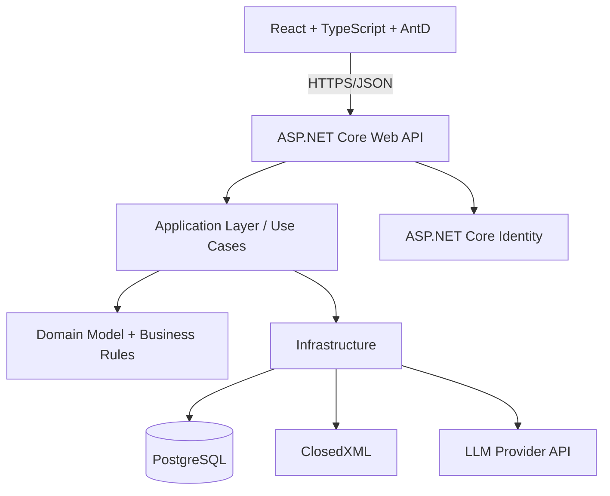

# CẤU TRÚC DỰ ÁN — HỆ THỐNG QUẢN LÝ KÝ TÚC XÁ (MVP 5 TUẦN)

> Đi kèm file `01-phan-tich-bai-toan-mvp.md` (chức năng, lộ trình, màu sắc/UI). File này tập trung vào **kỹ thuật**: tech stack, kiến trúc, cấu trúc thư mục, database, API, môi trường chạy — đã **rút gọn** so với bản phân tích gốc để vừa sức làm trong 5 tuần.

---

## 1. Tech stack

| Thành phần | Lựa chọn | Lý do ngắn gọn |
|---|---|---|
| Backend | ASP.NET Core Web API (.NET 10 LTS) | LTS, DI/auth/logging có sẵn, hợp với EF Core |
| Database | PostgreSQL | Transaction mạnh, constraint tốt, JSONB cho snapshot tính tiền |
| ORM | Entity Framework Core + Npgsql | Không cần Dapper/MediatR/AutoMapper ở MVP |
| Auth | ASP.NET Core Identity | Có sẵn hashing, role, tránh tự viết bảo mật |
| Frontend | React + TypeScript + Vite | Hệ sinh thái mạnh, tách rõ FE/BE, dễ demo |
| UI Component | Ant Design (1 thư viện duy nhất) | Đủ Form/Table/Modal/DatePicker cho CRUD + dashboard |
| Chart | Recharts (hoặc ECharts) | Nhẹ, đủ cho biểu đồ lấp đầy/doanh thu |
| Excel | ClosedXML | Đọc/ghi `.xlsx` cho template chỉ số điện nước |
| AI | `ILlmClient` → OpenAI API (hoặc provider tương đương) | Interface trừu tượng, dễ đổi provider sau này |
| Test | xUnit + `Microsoft.AspNetCore.Mvc.Testing` | Đủ cho unit test tính tiền + integration test luồng chính |
| Hạ tầng dev | Docker Compose (PostgreSQL) | Chạy local nhanh, đồng nhất giữa các máy trong nhóm |

**Không thêm ở MVP** (để không mất thời gian): MediatR, AutoMapper, Generic Repository/UnitOfWork riêng, Redis, message broker, microservices, vector database, Kubernetes, Serilog nâng cao, Testcontainers.

---

## 2. Kiến trúc tổng thể



Mô hình: **Modular Monolith** — một backend deploy duy nhất, một database, nhưng code chia module nghiệp vụ rõ ràng (Housing, Contracts, Utilities, Billing, Violations, Reports, AI). Đủ chuyên nghiệp, không tốn công triển khai microservices không cần thiết cho một đồ án 5 tuần.

Hướng phụ thuộc: `Api → Application → Domain`, và `Infrastructure` implement các interface do `Application` định nghĩa (không đi ngược chiều).

---

## 3. Cấu trúc thư mục Backend

```text
dormitory-management/
├── README.md
├── .gitignore
├── .env.example
├── docker-compose.yml
├── DormitoryManagement.sln
│
├── src/
│   ├── backend/
│   │   ├── Dormitory.Domain/
│   │   │   ├── Housing/          # Building, Room, Bed, RoomType
│   │   │   ├── Contracts/        # Application, Contract, BedAssignment
│   │   │   ├── Utilities/        # Utility, Meter, MeterReading, Tariff, TariffTier
│   │   │   ├── Billing/          # Bill, BillItem, Payment, Receipt
│   │   │   ├── Violations/       # ViolationType, Violation
│   │   │   └── Common/           # base entity, enums dùng chung
│   │   │
│   │   ├── Dormitory.Application/
│   │   │   ├── Identity/
│   │   │   ├── Housing/
│   │   │   │   ├── Buildings/  Rooms/  Beds/
│   │   │   ├── Contracts/
│   │   │   │   ├── Applications/  ApproveApplication/
│   │   │   │   ├── AssignBed/     TransferRoom/
│   │   │   ├── Utilities/
│   │   │   │   ├── Readings/  ExcelImport/  Tariffs/
│   │   │   ├── Billing/
│   │   │   │   ├── GenerateBill/  RecordPayment/  Receipts/
│   │   │   │   ├── BillingCalculator.cs   # nơi test kỹ nhất (tính bậc giá)
│   │   │   ├── Violations/
│   │   │   ├── Reports/          # OccupancyReport, RevenueReport
│   │   │   ├── AI/               # DraftPaymentReminder, SummarizeViolations
│   │   │   └── Common/           # IAppDbContext, ICurrentUser, ILlmClient
│   │   │
│   │   ├── Dormitory.Infrastructure/
│   │   │   ├── Persistence/
│   │   │   │   ├── AppDbContext.cs
│   │   │   │   ├── Configurations/
│   │   │   │   ├── Migrations/
│   │   │   │   └── Seed/
│   │   │   ├── Identity/
│   │   │   ├── Excel/            # ClosedXML template + import
│   │   │   ├── AI/               # OpenAiLlmClient
│   │   │   └── DependencyInjection.cs
│   │   │
│   │   └── Dormitory.Api/
│   │       ├── Controllers/
│   │       ├── Middleware/       # exception handling -> errorCode
│   │       ├── Authorization/    # policy: "OwnDataOnly", role policy
│   │       ├── Program.cs
│   │       └── appsettings.json
│   │
│   └── web/
│       ├── src/
│       │   ├── app/               # ConfigProvider theme, router root
│       │   ├── api/                # gọi API, DTO type
│       │   ├── auth/                # login, guard theo role
│       │   ├── components/          # component dùng chung (Badge trạng thái...)
│       │   ├── layouts/             # AdminLayout, StudentLayout
│       │   ├── features/
│       │   │   ├── housing/         # building/room/bed, room matrix
│       │   │   ├── applications/    # đăng ký, duyệt, phân giường
│       │   │   ├── contracts/       # chi tiết hợp đồng, chuyển phòng
│       │   │   ├── utilities/       # chỉ số, import excel, tariff
│       │   │   ├── billing/         # hoá đơn, thanh toán, biên lai
│       │   │   ├── violations/
│       │   │   ├── dashboard/
│       │   │   └── ai/              # nút "soạn nhắc nợ", "tóm tắt AI"
│       │   ├── routes/
│       │   └── main.tsx
│       ├── package.json
│       └── vite.config.ts
│
├── tests/
│   ├── Dormitory.Domain.Tests/         # test BillingCalculator (ưu tiên cao nhất)
│   └── Dormitory.Api.IntegrationTests/ # test luồng đăng ký -> hợp đồng -> hoá đơn
│
├── scripts/
│   ├── dev-up.sh
│   ├── migrate.sh
│   └── seed.sh
│
└── .github/workflows/ci.yml   # build + test, không cần pipeline phức tạp
```

> Lý do giữ **feature folders** trong Application/Frontend: khi sửa module Utilities không phải lục khắp project; đúng với cách chia chức năng ở file phân tích (Mục 3).

---

## 4. Database — danh sách bảng (đã rút gọn cho MVP)

### 4.1. Nhóm Identity
- `AspNetUsers`, `AspNetRoles` (Identity mặc định) + `student_profiles` (student_code, ngày sinh, giới tính, khoa, khoá học).

### 4.2. Nhóm Housing Inventory
- `buildings` (code*, name, address, floors, status)
- `room_types` (name, default_monthly_rate)
- `rooms` (building_id, code, room_type_id, status) — unique `(building_id, code)`
- `beds` (room_id, code, status) — unique `(room_id, code)`

### 4.3. Nhóm Applications / Contracts
- `housing_applications` (student_id, term_code, preferred_room_type_id, status, rejection_reason)
- `contracts` (contract_no*, student_id, start_date, end_date, status, base_rate, terminated_at)
- `bed_assignments` (contract_id, bed_id, start_date, end_date, status) — **bảng quan trọng nhất** để xử lý chuyển phòng & lịch sử lấp đầy

### 4.4. Nhóm Utilities
- `utilities` (code: ELECTRICITY/WATER, unit)
- `meters` (room_id, utility_id, meter_code*)
- `meter_readings` (meter_id, period_start, period_end, previous_reading, current_reading, consumption, source: Manual/ExcelImport) — unique `(meter_id, period_start, period_end)`, constraint `current_reading >= previous_reading`
- `utility_tariffs` (utility_id, effective_from, effective_to, pricing_mode)
- `tariff_tiers` (tariff_id, tier_order, from_quantity, to_quantity, unit_price)

### 4.5. Nhóm Billing
- `bills` (bill_no*, student_id, contract_id, period_start, period_end, subtotal, paid_amount, balance_due, status)
- `bill_items` (bill_id, type: HousingFee/Electricity/Water/ViolationFine/Adjustment, amount, calculation_snapshot_json)
- `payments` (payment_no*, bill_id, amount, method, paid_at) — cho phép nhiều payment/1 bill
- `receipts` (receipt_no*, payment_id* — unique, issued_at)

### 4.6. Nhóm Violations
- `violation_types` (code, name, default_severity, default_fine_amount)
- `violations` (student_id, contract_id, violation_type_id, occurred_at, severity, status, fine_amount)

### 4.7. Nhóm Import (tối giản)
- `import_batches` (type: MeterReading, file_name, status, uploaded_by, uploaded_at) — không cần thống kê chi tiết valid/invalid rows nếu thiếu thời gian, chỉ cần biết batch nào đã confirm.

*(dấu `*` = cột cần ràng buộc `unique`)*

### 4.8. Constraint bắt buộc kiểm tra kỹ trước khi nộp

```text
[ ] buildings.code unique
[ ] rooms(building_id, code) unique
[ ] beds(room_id, code) unique
[ ] contracts.contract_no unique
[ ] meter_readings(meter_id, period_start, period_end) unique
[ ] current_reading >= previous_reading
[ ] bills.bill_no unique
[ ] payments.payment_no unique
[ ] receipts.payment_id unique
[ ] payments.amount > 0
[ ] không có 2 bed_assignments trùng thời gian cho cùng 1 bed
```

---

## 5. API surface (rút gọn theo module — RESTful, JSON)

```http
# Auth
POST   /api/auth/login
POST   /api/auth/logout

# Housing inventory
GET    /api/buildings
POST   /api/buildings
GET    /api/rooms?buildingId=
POST   /api/rooms
GET    /api/beds?roomId=
POST   /api/beds
GET    /api/room-matrix                     # dữ liệu cho sơ đồ trạng thái giường

# Applications / Contracts
POST   /api/housing-applications            # sinh viên tạo
GET    /api/housing-applications?status=
POST   /api/housing-applications/{id}/approve
POST   /api/housing-applications/{id}/reject
POST   /api/contracts/{applicationId}/assign-bed
POST   /api/contracts/{id}/transfer         # chuyển phòng
POST   /api/contracts/{id}/terminate
GET    /api/contracts/{id}/assignment-history

# Utilities
GET    /api/utility-tariffs
POST   /api/utility-tariffs
POST   /api/meter-readings                  # nhập tay
GET    /api/meter-readings/template         # tải file excel mẫu
POST   /api/meter-readings/import/preview   # upload -> validate, chưa lưu
POST   /api/meter-readings/import/confirm   # lưu chính thức

# Billing
POST   /api/bills/generate                  # phát hành hoá đơn theo kỳ
GET    /api/bills?studentId=&status=
GET    /api/bills/{id}
POST   /api/payments                        # ghi nhận thanh toán
GET    /api/receipts/{id}

# Violations
POST   /api/violations
POST   /api/violations/{id}/confirm
POST   /api/violations/{id}/reject
GET    /api/violations?studentId=

# Reports
GET    /api/reports/occupancy
GET    /api/reports/revenue

# AI (chỉ Admin/Staff)
POST   /api/ai/draft-payment-reminder
POST   /api/ai/summarize-violations/{studentId}
```

### Quy ước response lỗi (frontend xử lý theo `errorCode`, không parse message)

```http
409 Conflict
{
  "errorCode": "BED_ASSIGNMENT_CONFLICT",
  "message": "Giường đã có người ở trong khoảng thời gian này."
}
```

Danh sách `errorCode` tối thiểu cần có: `BED_NOT_AVAILABLE`, `BED_ASSIGNMENT_CONFLICT`, `METER_READING_INVALID_SEQUENCE`, `BILL_ALREADY_EXISTS`, `PAYMENT_EXCEEDS_BALANCE`, `AI_PROVIDER_UNAVAILABLE`.

---

## 6. Cấu hình môi trường

### `.env.example`
```env
POSTGRES_DB=dormitory
POSTGRES_USER=dormitory
POSTGRES_PASSWORD=changeme
ConnectionStrings__Default=Host=localhost;Database=dormitory;Username=dormitory;Password=changeme

Llm__Provider=OpenAI
Llm__Model=<model-name>
OPENAI_API_KEY=<secret>   # chỉ nằm ở backend, không đưa sang React
```

### `docker-compose.yml` (rút gọn)
```yaml
services:
  postgres:
    image: postgres:16
    environment:
      POSTGRES_DB: dormitory
      POSTGRES_USER: dormitory
      POSTGRES_PASSWORD: changeme
    ports: ["5432:5432"]
    volumes: ["pgdata:/var/lib/postgresql/data"]
volumes:
  pgdata:
```

Chạy local: `docker compose up -d` → `dotnet ef database update` → `dotnet run` (API) → `npm run dev` (web).

---

## 7. Naming convention (ngắn gọn, để cả nhóm thống nhất từ đầu)

- **C# backend**: PascalCase cho class/method, camelCase cho biến local, tên bảng số nhiều snake_case ở PostgreSQL (`bed_assignments`), cột snake_case.
- **API route**: kebab-case, số nhiều cho collection (`/housing-applications`).
- **React**: PascalCase cho component (`RoomMatrix.tsx`), camelCase cho hook/function, tên file feature theo domain (`features/billing/BillDetail.tsx`).
- **Enum trạng thái**: PascalCase tiếng Anh trong code (`Approved`, `PartiallyPaid`) — hiển thị tiếng Việt ở tầng UI qua bảng mapping, không hard-code chuỗi tiếng Việt trong logic.

---

## 8. Testing tối thiểu bắt buộc

| Loại | Bắt buộc? | Ghi chú |
|---|---|---|
| Unit test `BillingCalculator` (tính bậc giá) | **Bắt buộc** | Đây là logic dễ sai nhất và bị chấm kỹ nhất |
| Integration test luồng đăng ký → hợp đồng → hoá đơn | **Bắt buộc** | 1 test end-to-end là đủ, không cần bao phủ mọi nhánh |
| Unit test chống double-booking giường | **Bắt buộc** | Test 2 assignment chồng thời gian phải bị chặn |
| Test frontend (component/e2e) | Tuỳ chọn | Chỉ làm nếu còn thời gian ở tuần 5 |

---

## 9. Migration & Seed

- Mỗi thay đổi schema = 1 migration (`dotnet ef migrations add ...`), không sửa migration đã chạy.
- Seed dữ liệu demo (`scripts/seed.sh`): 1 Admin, 2 Staff, 5–10 Student, 1 tòa với vài phòng/giường, 1 bảng giá điện/nước có 2–3 bậc — đủ để chạy hết checklist nghiệm thu ở file phân tích (Mục 7).
- Không hard-code mật khẩu admin production trong source; MVP đồ án có thể seed qua `appsettings.Development.json` nhưng cần ghi rõ trong README là "chỉ dùng cho môi trường phát triển".

---

## 10. Việc để lại sau MVP (ghi rõ để không quên, không phải để làm ngay)

```text
- room_transfer_requests dạng workflow 2 bước (sinh viên yêu cầu -> duyệt riêng)
- contract_amendments dạng log JSON đầy đủ lịch sử thay đổi hợp đồng
- Trạng thái "Appealed" (khiếu nại) cho vi phạm
- import_batches với thống kê chi tiết valid/invalid rows
- Audit log toàn hệ thống (hiện tại chỉ log hành động tài chính nhạy cảm)
- AI giải thích dashboard bằng ngôn ngữ tự nhiên (F28)
- Thanh toán online qua cổng ngân hàng, IoT đọc công tơ tự động, quản lý khách ra/vào
```
